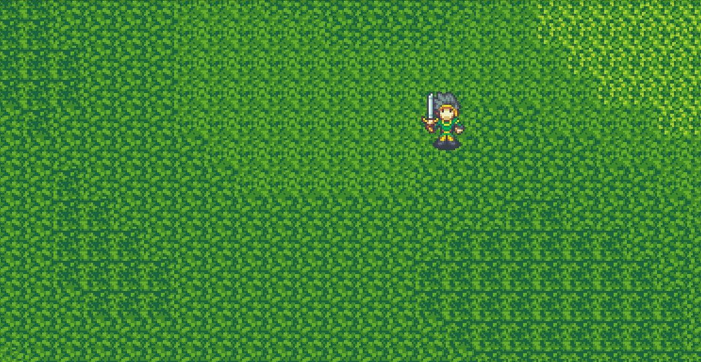

# Bevy playground

PoC of bevy features to create a simple game.

## Features

- [X] Animated Sprites
- [X] Input control
- [X] Input control affect movement
- [X] Simple text ui
- [ ] ui - Player state
- [ ] Interactive ui - Menu
- [ ] Enemy spawn
- [ ] Player attack Animation + Logic
	- [ ] Close
	- [ ] Far Bullet (Hit-Dmg)
	- [ ] Far Spell (Hit-Dmg-Spell)
- [ ] Enemy attack
- [ ] Player defense
- [-] Physics 
	- [-] Hit detection
	- [ ] Movement by Physics engine
	- [ ] Temporal influence (stunn, slowed)
- [ ] Network
	- [ ] Environment sync
	- [ ] Enemy sync
	- [ ] Splayer sync
		- [ ] Position/Velocity
		- [ ] Action

## Next steps

### General
- Read Rapier engine - https://rapier.rs/docs/user_guides/bevy_plugin/getting_started_bevy/
- Read multiplayer fundamentals https://leanpub.com/b/development-and-deployment-of-multiplayer-online-games-part-arch
- ... 

### UI
- Understand Bevy UI https://bevyengine.org/examples/ui/ui/
  - Create main menu (Start, Show controls, Exit)
  - Create pause menu

### Refactor
- Load terrain async - https://github.com/bevyengine/bevy/blob/latest/examples/async_tasks/async_compute.rs
- Add loading screen offets (show animated loading screen at least 3sec)
- ...

## Update 10.09.2022

